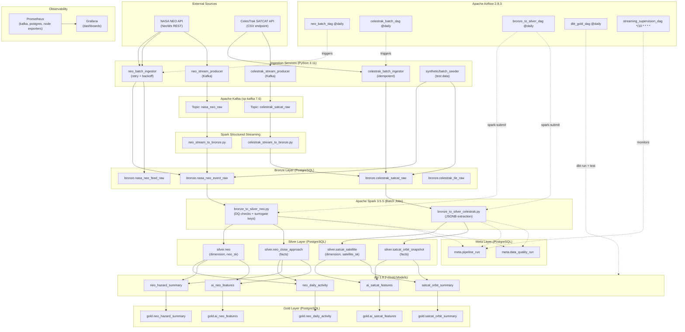
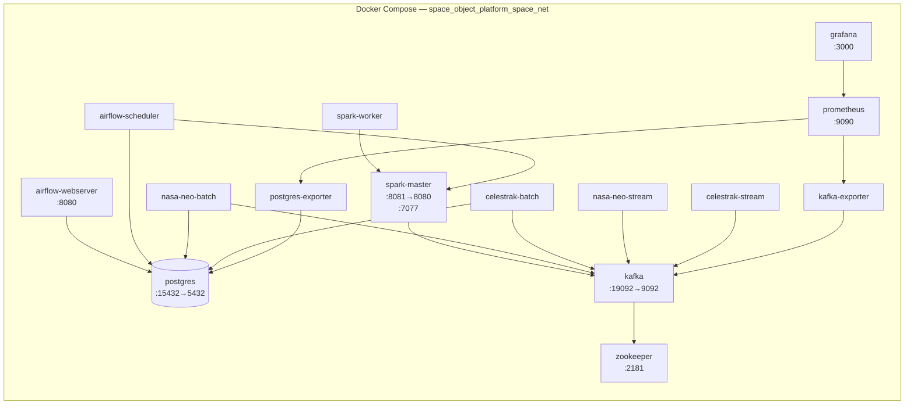
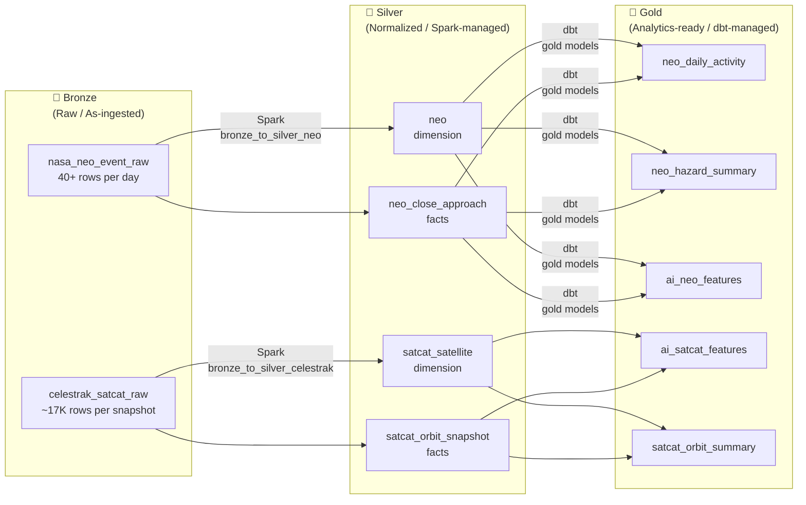

# Architecture Diagram – Space Objects Data Platform

## System Architecture

---

## Container Topology

---

## Medallion Architecture

---

## Pipeline Orchestration (DAG Dependencies)

```mermaid
gantt
    title Daily Pipeline Schedule (UTC)
    dateFormat HH:mm
    section Ingestion
    neo_batch_dag           :00:00, 5m
    celestrak_batch_dag     :00:05, 10m
    section Transformation
    bronze_to_silver_dag    :00:20, 15m
    dbt_gold_dag            :00:40, 5m
    section Monitoring
    streaming_supervision   :00:00, 1m
```

---

## Key Design Decisions

| Decision | Choice | Rationale |
|---|---|---|
| Warehouse | PostgreSQL 15 | Single storage system; avoids multi-system complexity |
| Spark image | `apache/spark:3.5.5` | Official image; bitnami 3.5.5 does not exist |
| Spark → Postgres | JDBC + `stringtype=unspecified` | Allows varchar → uuid implicit cast |
| pipeline_run insert | psycopg2 at job start | Enables FK from data_quality_run; JDBC can't UPDATE |
| dbt silver models | Ephemeral | Avoids naming collision with Spark-managed tables |
| dbt schema routing | `generate_schema_name` macro | Bypasses dbt's default `{profile_schema}_{model_schema}` prefix |
| Port remapping | 15432, 19092 | Avoids conflicts with other local Postgres/Kafka instances |
| Synthetic data | `services/synthetic/` | Physically realistic; enables offline testing |
| Kafka healthcheck | `kafka-broker-api-versions` | Works inside cp-kafka without separate tools |
